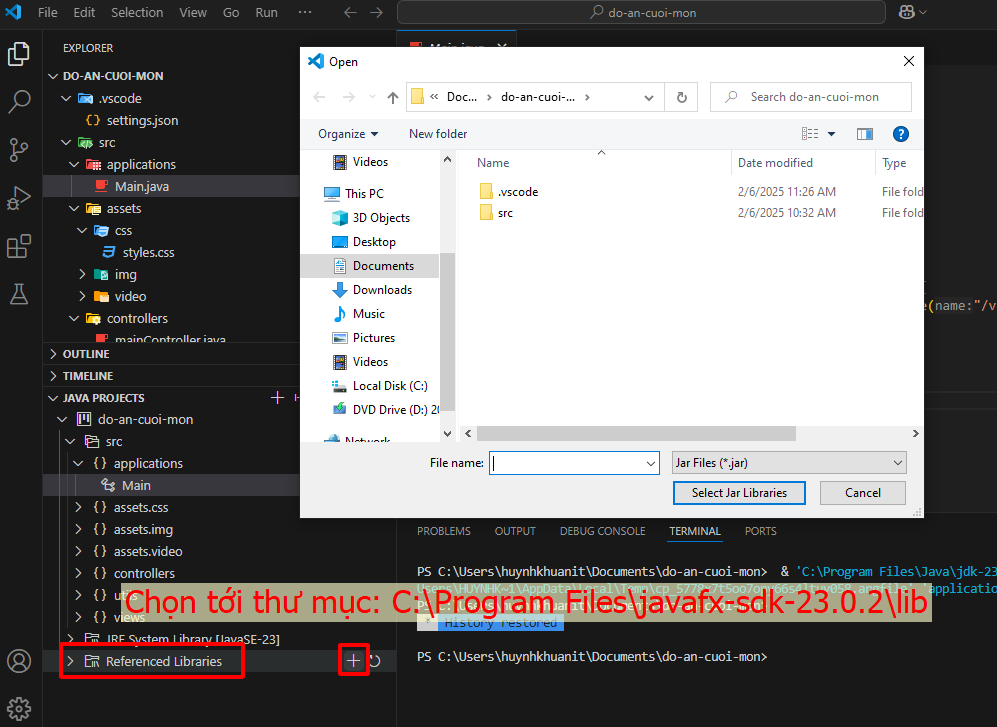
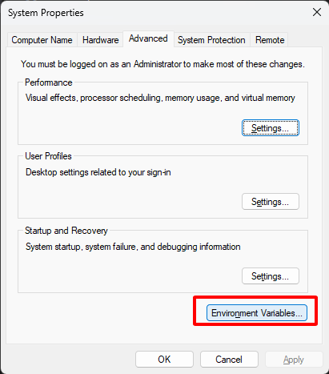
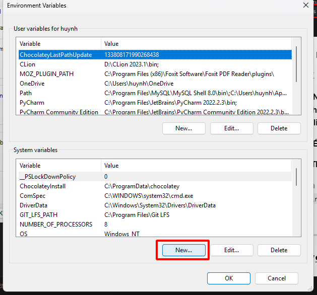
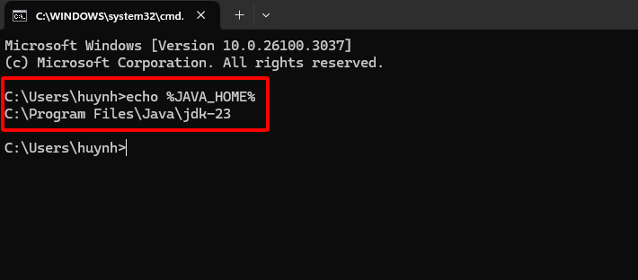
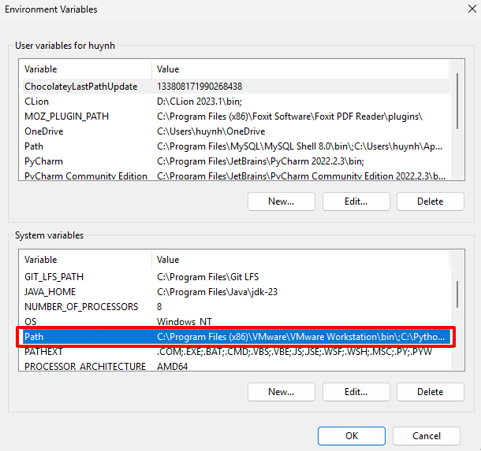
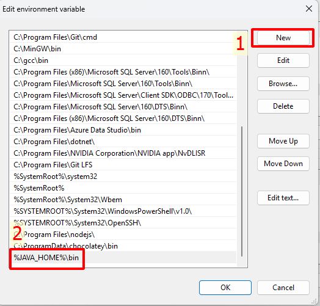
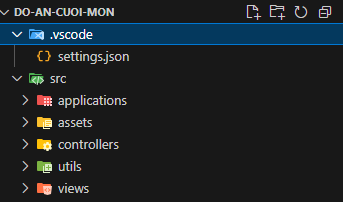
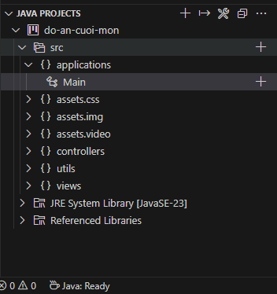

# **Hướng Dẫn Setup Môi Trường JavaFX Với JDK 23 & JavaFX SDK 23 trên VS Code**

## **1️⃣ Cài Đặt JDK 23**
### **📌 Bước 1: Tải và Cài Đặt JDK 23**
- Tải JDK 23 từ [Oracle JDK](https://www.oracle.com/java/technologies/javase/jdk23-archive-downloads.html) hoặc [Adoptium](https://adoptium.net/)
- Cài đặt JDK và ghi nhớ đường dẫn thư mục cài đặt (ví dụ: `C:\Program Files\Java\jdk-23`)

### **📌 Bước 2: Kiểm tra JDK đã cài đặt đúng chưa**
Mở **Terminal** (`Windows Terminal`, `CMD`, `PowerShell`) và chạy:
```sh
java -version
javac -version
```
📌 **Kết quả mong đợi:**
```
java version "23.0.1" ...
javac 23.0.1 ...
```

---

## **2️⃣ Cài Đặt JavaFX SDK 23**
### **📌 Bước 1: Tải JavaFX SDK 23**
- Tải từ [GluonHQ](https://gluonhq.com/products/javafx/)
- Giải nén và đặt thư mục vào một nơi cố định, ví dụ: `C:\Program Files\javafx-sdk-23`

### **📌 Bước 2: Thêm JavaFX vào biến môi trường**
Mở **CMD hoặc PowerShell** và chạy lệnh sau:
```sh
setx PATH_TO_FX "C:\Program Files\javafx-sdk-23.0.2\lib"
```

Hoặc bạn cũng có thể sử dụng cách (xem hình ảnh phía dưới):


- Cách này bạn thực hiện khi đã cài đặt hết các extension và test code mẫu.

📌 **Lưu ý:** Nếu JavaFX SDK đặt ở nơi khác, hãy thay đổi đường dẫn cho đúng.

📌 **LƯU Ý QUAN TRỌNG ⚠️:** Nếu bạn nào cài đặt **Java JDK** ở **Oracle** thuộc phiên bản **`Java JDK 23.0.1`** mà cài đặt **JavaFX ở phiên bản 23.0.2** sẽ gây ra xung đột phiên bản. Nên đồng bộ của 2 JavaFX và Java JDK 👉 Các bạn tải lại **liên kết 23.0.1** cho mình nha

📌 **CẬP NHẬT LIÊN KẾT:** Các bạn tải JavaFX 23.0.1 ở đây 👉 [JavaFX 23.0.1](https://drive.google.com/file/d/1YwK6g4ej_O5FFtVD4UIwIBLBLyEIjS7q/view?usp=drive_link)

📌 **SETUP BIẾN MÔI TRƯỜNG:**

- Các bạn setup biến môi trường cho mình với `JAVA_HOME` như sau:

- Vào `Edit Environment System Variables` 👉 Bật Windows lên tìm kiếm.



- Chọn > `New`.



- Tạo biến `JAVA_HOME` như hình.


- Vào CMD gõ `echo %JAVA_HOME%`, nếu như hình thì thành công bạn nhé!



- Tiếp thục vào `Edit Environment System Variables` 👉 Chọn **Path**.



- Chọn vào **NEW** 👉 Thêm đường dẫn như hình (viết chính xác nhé) vào **PATH**. Sau đó OK rồi OK thoát ra bình thường thôi nhé!



📌 **Với những bước trên bạn đã có thể chạy được JavaFX không lỗi nhé! Cám ơn các bạn vì đã tìm ra lỗi cài đặt này!**

---

## **3️⃣ Cài Đặt VS Code & Extensions JavaFX**
### **📌 Bước 1: Cài đặt VS Code**
- Tải và cài đặt [VS Code](https://code.visualstudio.com/)

### **📌 Bước 2: Cài đặt các Extension cần thiết**

- Đã có sẵn setup **Extension** dành cho JavaFX trên VS Code mà không cần cài đặt thủ công 👉 Các bạn tải trên `github` nhé!
- Đường dẫn tải: [Tải extension](https://drive.google.com/drive/folders/1aJgC0fzTgg3i2AaZzvL3PeFsPzc--cWV?usp=sharing).
- Sau khi tải folder về 👉 **Copy & Paste** vào đường dẫn sau:

```sh
C:\Users\huynhkhuanit\.vscode
```

- Trong `.vscode` có thư mục **extension**:
    - **1️⃣ : Nếu không muốn bị ghi đè các extension khác 👉 Hãy copy từng thư mục trong `C:\Users\huynhkhuanit\.vscode` 👉 Chỉ ghi đè các thư mục trùng.**
    - **2️⃣ : Nếu thư mục của bạn rỗng, bạn có thể paste tất cả vào 🚀**

### **📌 Bước 3: Cấu hình `settings.json` cho JavaFX**

- Đã có sẵn file `settings.json` được push trên github, các bạn tải về nhé!
- Sau khi cài đặt 👉 Các bạn **copy** file `settings.json` và **paste** theo đường dẫn sau:

```sh
C:\Users\huynhkhuanit\AppData\Roaming\Code\User
```

- **Lưu ý ⚠️**: Phần **`%username%`** các bạn thay thành theo của các bạn nhé! 🚀

**More Option**: Mở **VS Code**, vào **File > Preferences > Settings**, chọn **Edit in JSON** (`settings.json`), thêm:

```json
{
    "workbench.iconTheme": "material-icon-theme",
    "redhat.telemetry.enabled": true,
    "java.debug.settings.vmArgs": "--module-path \"C:\\Program Files\\javafx-sdk-23.0.2\\lib\" --add-modules javafx.controls,javafx.fxml",
    "explorer.confirmDelete": false,
    "terminal.integrated.enableMultiLinePasteWarning": "never",
    "editor.wordWrap": "on"
}
```

📌 **Lưu ý:** Chỉnh sửa đường dẫn JDK nếu khác.

---

## **4️⃣ Chạy Ứng Dụng JavaFX**

### **🎯 Chạy dự án mẫu**

- Mình đã cập nhật file .zip với tên là "do-an-cuoi-mon" với cấu trúc sau:

```css
do-an-cuoi-mon/
│── src/
│   ├── applications/   # Chứa các lớp chính của ứng dụng JavaFX
│   ├── assets/         # Chứa tài nguyên (hình ảnh, font, CSS...)
│   ├── controllers/    # Chứa các Controller xử lý sự kiện
│   ├── utils/          # Chứa các class tiện ích (helper, config...)
│   ├── views/          # Chứa file FXML thiết kế giao diện
│── .vscode/            # Cấu hình VS Code (settings.json)
```

- Các bạn tìm đến `Main.java` nằm trong `applications` và đợi đến khi **Java : Ready** là có thể ấn Run để chạy dự án.

- Hình ảnh cấu trúc thư mục:



- Hình ảnh Java : Ready:



- Dự án mẫu trên để **test** xem setup môi trường với JavaFX bằng VSCode thành công hay chưa!
- Hy vọng bài viết này có ích đối với các bạn! Chúc thành công và hẹn gặp lại 👋

---

## **🎯 Tổng Kết**
| Bước | Nội dung |
|------|---------|
| **1** | Cài đặt **JDK 23** |
| **2** | Cài đặt **JavaFX SDK 23** và thêm vào `PATH_TO_FX` |
| **3** | Cài đặt **VS Code & Extensions** cho JavaFX |
| **4** | Cấu hình **`settings.json`** |
| **5** | Chạy ứng dụng JavaFX bằng **Terminal hoặc VS Code** |

✅ **Giờ bạn có thể lập trình JavaFX với VS Code một cách dễ dàng! 🚀**

📌 **Nếu có lỗi, kiểm tra lại đường dẫn JDK/JavaFX hoặc báo lỗi để được hỗ trợ.**
📌 **Liên hệ: Facebook 👉 [huynhkhuanit](https://www.facebook.com/huynhkhuanit/)**
📌 **Liên hệ: Zalo 👉 0943006018**
